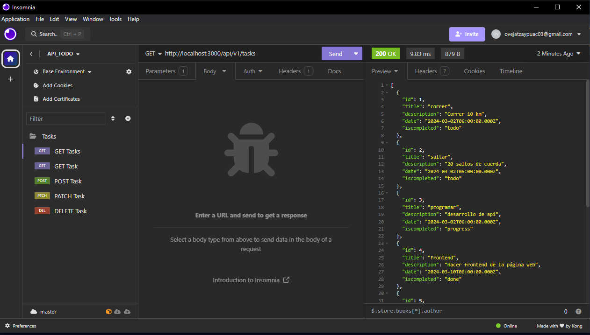
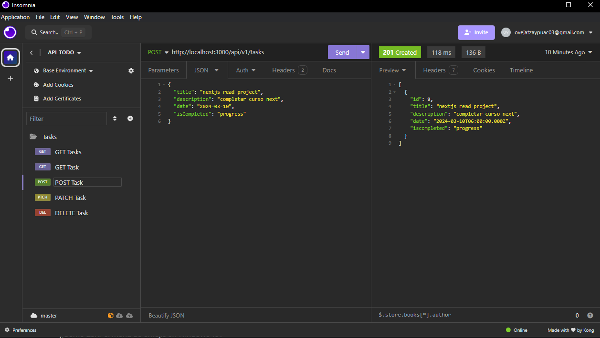

# React + Vite

This template provides a minimal setup to get React working in Vite with HMR and some ESLint rules.

Currently, two official plugins are available:

- [@vitejs/plugin-react](https://github.com/vitejs/vite-plugin-react/blob/main/packages/plugin-react/README.md) uses [Babel](https://babeljs.io/) for Fast Refresh
- [@vitejs/plugin-react-swc](https://github.com/vitejs/vite-plugin-react-swc) uses [SWC](https://swc.rs/) for Fast Refresh.

## Descripción
ToDo App es una aplicación web que permite agregar nuevas tareas, cada tarea tiene:
- titulo
- descripción
- Fecha
- Estado

Podemos aplicar filtros de búsqueda. La App utiliza el LocalStorage del navegador para persistencia de datos local.

## :hammer:Funcionalidades del proyecto

- `Funcionalidad 1`: agregar nuevas tareas
- `Funcionalidad 2`: cambiar el estado de las tareas dandole check al boton circular a la derecha.
- `Funcionalidad 2a`: Cada tarea dependiendo del estado cambia de color
- `Funcionalidad 3`: filtrar las tareas por el estado usando una lista desplegable
- `Funcionalidad 4`: Búsqueda de tareas específicas ingresando el valor a encontrar en el input de búsqueda.
- `Funcionalidad 5`: Eliminar tareas.
## 📁 Acceso al proyecto

### 🛠️ Abre y ejecuta el proyecto

- Clonar el repositorio
- Ejecutar el comando `npm install`
- Ejcutar el comand `npm run dev`

## PROJECT BACKEND
### Conecting our react project with ournb  backend in Nodejs and PostgeSql
* change a branch  `v2`
* run the next code for view the backend project `git checkout v2`
* be located in the `backend` folder
* run the next code `npm intall`
* To run the backend project we execute the following code: `npm run dev`
### 🧪 Testing endpoints
✅ `GET tasks:` get all the tasks
`http://localhost:3000/api/v1/tasks`
✅ `GET task:` get a specific task
`http://localhost:3000/api/v1/tasks/id`
✅ `POST task:` create new task
`http://localhost:3000/api/v1/tasks`
✅ `PATCH task:` update a specific task
`http://localhost:3000/api/v1/tasks/id`
✅ `DELETE task:` delete a specific task
`http://localhost:3000/api/v1/tasks/id`
### example screenshot 

